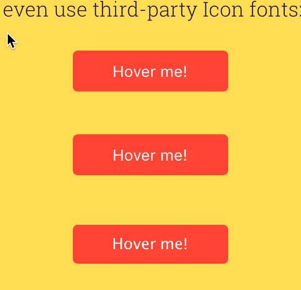

# Balloon.css
## Simple tooltips made of pure CSS
Balloon.css lets you add tooltips to elements without JavaScript and in just a few lines of CSS.



## Usage
### Positioning
For positioning, use `data-balloon-pos` attribute with one of the values: `up`, `down`, `left` or `right`:

```html
<button data-balloon="Whats up!" data-balloon-pos="up">Hover me!</button>
<button data-balloon="Whats up!" data-balloon-pos="left">Hover me!</button>
<button data-balloon="Whats up!" data-balloon-pos="right">Hover me!</button>
<button data-balloon="Whats up!" data-balloon-pos="down">Hover me!</button>
```

### Glyphs and Icon Fonts
You can also add any HTML special character to your tooltips, or even use third-party Icon fonts:

```html
<button data-balloon="HTML special characters: &#9787; &#9986; &#9820;" data-balloon-pos="up">Hover me!</button>
<button data-balloon="Emojis: 😀 😬 😁 😂 😃 😄 😅 😆" data-balloon-pos="up">Hover me!</button>
```

Example using [Font Awesome](https://fortawesome.github.io/Font-Awesome/):

```html
<button class="fa" data-balloon="Font Awesome: &#xf030; &#xf133; &#xf1fc; &#xf03e; &#xf1f8;" data-balloon-pos="up">Hover me!</button>
```


### Credits

Made by Claudio Holanda ([@kazzkiq](https://twitter.com/kazzkiq))
